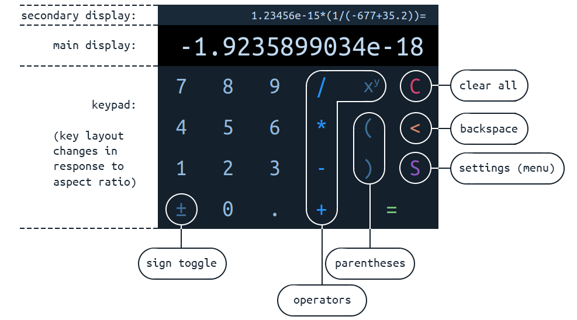

# calculator

Solution to the [Odin Project "Calculator" exercise](https://www.theodinproject.com/courses/web-development-101/lessons/calculator); (unfinished)  
by Simon Tharby (a.k.a. jinjagit), 2018.  
[view in browser](https://jinjagit.github.io/calculator/)  

  

**Features:**  

* mobile focused, minimal, responsive design, with desktop default layout (scaled relative to screen size and responsive under certain conditions)
* one of 3 layouts is automatically chosen to best fit aspect ratio constraints:  

* calculator evaluates expressions containing multiple operators, with or without parentheses
* calculator only accepts well-formed expressions
* content of main display can be backspace deleted to edit
* result displayed in main display can become first part of new expression
* last operator added to expression (in secondary display) can be backspace deleted and replaced
* all animations halt on user input, ensuring a responsive experience

**Not yet implemented:**

* settings menu (maximize/full-screen toggle, theme toggle, l/r-handed toggle)
* second theme
* some error/warning messages
* some animations
* animations to stop on any subsequent input (improve responsiveness and avoid impeding further input)
* 'F' (full-screen) key; only on mobile, letterbox layout
* 'quick operation'; result given if '=' input after first operator
